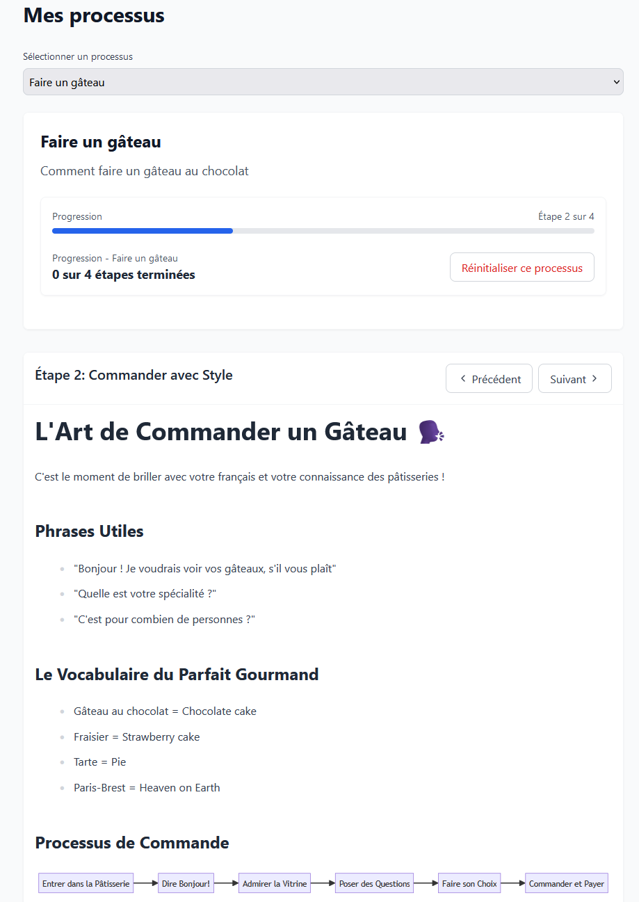

# Process Guide App

A dynamic web application for managing and following step-by-step processes with interactive features and local progress tracking.

## Features

- 📝 Step-by-step process guides
- ✅ Interactive task checklists
- 💾 Local progress saving
- 📊 Progress tracking
- 🔄 Multiple process support
- 📱 Responsive design
- ✨ Markdown support with:
  - Checkboxes
  - Mermaid diagrams
  - GFM (GitHub Flavored Markdown)



## Technology Stack

- React
- TailwindCSS
- Unified/Remark for Markdown processing
- LocalStorage for progress persistence
- Lucide React for icons

## Getting Started

### Prerequisites

- Node.js (v14 or higher)
- npm or yarn

### Installation

1. Clone the repository:

    ```bash
    git clone [repository-url]
    ```

2. Install dependencies:

    ```bash
    npm install
    ```

3. Start the development server:

    ```bash
    npm run dev
    ```

## Usage

### Adding New Processes

Create new process definitions in the `processes` directory.

### Markdown Support

The app supports enhanced markdown with:

- Standard markdown formatting
- Mermaid diagrams

## Local Storage

The application uses browser local storage to maintain:

- Process completion status
- Task checkboxes state
- Storage notice dismissal

## Deploying

The application can be deployed to a static web site:

- S3 + Cloudfront
- GitHub or GitLab pages
