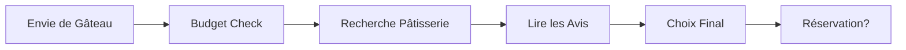

# À la Recherche du Gâteau Parfait 🎂

Première étape de notre grande aventure : trouver LE gâteau qui fera sensation !

## Les Critères Essentiels

- [ ] Un gâteau qui fait "Wow!" quand on le voit
- [ ] Assez grand pour tout le monde (et les deuxièmes parts...)
- [ ] Dans notre budget (mais on peut rêver un peu)

## Guide de Sélection

Pour choisir le gâteau parfait, considérez :

- Le nombre d'amis gourmands
- Les allergies éventuelles
- La saison (on évite la crème au beurre en été !)

## Processus de Décision

