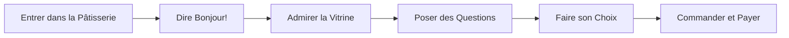

# L'Art de Commander un Gâteau 🗣️

C'est le moment de briller avec votre français et votre connaissance des pâtisseries !

## Phrases Utiles
- "Bonjour ! Je voudrais voir vos gâteaux, s'il vous plaît"
- "Quelle est votre spécialité ?"
- "C'est pour combien de personnes ?"

### Le Vocabulaire du Parfait Gourmand
- Gâteau au chocolat = Chocolate cake
- Fraisier = Strawberry cake
- Tarte = Pie
- Paris-Brest = Heaven on Earth

**Processus de Commande**

