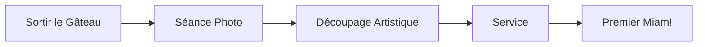

# Le Grand Moment : La Dégustation 🍽️

Enfin, le moment que tout le monde attend : déguster notre chef-d'œuvre !

## L'Art de la Dégustation

- [ ] Photos pour Instagram (c'est obligé)
- [ ] Couper des parts égales (ou presque)
- [ ] Savourer chaque bouchée

## Règles de Savoir-Vivre

Pour une dégustation réussie :

- Attendre que tout le monde soit servi
- Complimenter le chef pâtissier
- Débattre de la technique de coupe parfaite

## Processus de Dégustation

